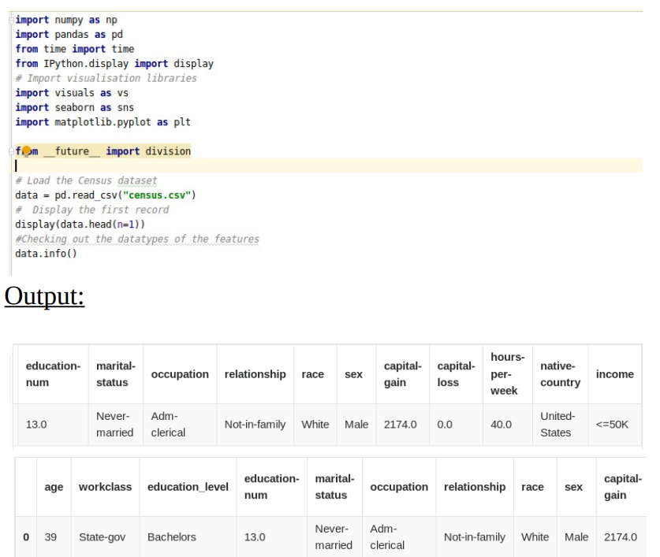
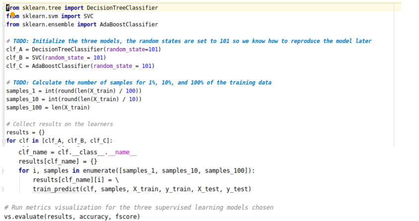

# Finding Donors for Charity
A Supervised Machine Learning project using Scikit Learn to predict donors for a charity organization.

## ABOUT THE PROJECT
In this project, you will employ several supervised algorithms of
your choice to accurately model individuals’ income using data
collected from the 1994 U.S. Census. You will then choose the
best candidate algorithm from preliminary results and further
optimize this algorithm to best model the data. Your goal with this
implementation is to construct a model that accurately predicts
whether an individual makes more than $50,000.This sort of task
can arise in a non-profit setting, where organizations survive on
donations. Understanding an individual’s income can help a nonprofit better understand how large of a donation to request, or
whether or not they should reach out to begin with. While it can be
difficult to determine an individual’s general income bracket
directly from public sources, we can infer this value from other
publically available features.

In this project, we will apply supervised learning techniques and an analytical mind on data collected for the U.S. census to help CharityML (a fictitious charity organization) to identify people most likely to donate to their cause. We will first explore the data to learn how the census data is recorded and then will apply a series of transformations and preprocessing techniques to manipulate the data into a workable format. We will then evaluate several supervised learners of choice on the data, and consider which is best suited for the solution. Afterwards, we will optimize the selected model and present it as the solution to CharityML. Finally, we will explore the chosen model and its predictions under the hood, to see just how well it's performing when considering the data it's given.

## Software and Libraries
This project uses the following software and Python libraries:

- Python 3
- NumPy
- pandas
- scikit-learn (v0.17)
- matplotlib

## DATA VISUALIZATION
By running the code cell below to load necessary Python libraries
and load
the census data.By targeting the dataset “income”(whether an
individual
makes more than ,or at most,50K annually). All other columns are
features about each individual in the census database.
 
 
 sns.factorplot("sex" , col="education_level",data=data,hue="income",kind="count", col_wrap=4);
 
  ### Output:
 
 
## Featureset Exploration
age: continuous.
• workclass: Private, Self-emp-not-inc, Self-emp-inc, Federalgov,
Local-gov, State-gov, Without-pay, Never-worked.
• education: Bachelors, Some-college, 11th, HS-grad, Profschool,
Assoc-acdm, Assoc-voc, 9th, 7th-8th, 12th, Masters, 1st-4th, 10th,
Doctorate, 5th-6th, Preschool.
• education-num: continuous.
• marital-status: Married-civ-spouse, Divorced, Never-married,
Separated, Widowed, Married-spouse-absent, Married-AF-spouse.
• occupation: Tech-support, Craft-repair, Other-service, Sales,
Exec-managerial, Prof-specialty, Handlers-cleaners, Machine-opinspct,
Adm-clerical, Farming-fishing, Transport-moving, Priv-houseserv,
Protective-serv, Armed-Forces.
• relationship: Wife, Own-child, Husband, Not-in-family,
Other-relative, Unmarried.
• race: Black, White, Asian-Pac-Islander, Amer-Indian-Eskimo,
Other.
• sex: Female, Male.
• capital-gain: continuous.
• capital-loss: continuous.
• hours-per-week: continuous.
• native-country: United-States, Cambodia, England, PuertoRico,
Canada, Germany, Outlying-US(Guam-USVI-etc), India, Japan,
Greece,
South, China, Cuba, Iran, Honduras, Philippines, Italy, Poland,
Jamaica,
Vietnam, Mexico, Portugal, Ireland, France, Dominican-Republic,
Laos,
Ecuador, Taiwan, Haiti, Columbia, Hungary, Guatemala,
Nicaragua,
Scotland, Thailand, Yugoslavia, El-Salvador, Trinadad&Tobago,
Peru,
Hong, Holand-Netherlands.

## Preparing the Data

Before data can be used as input for machine learning algorithms,
it often must be cleaned, formatted, and restructured — this is
typically known as preprocessing. Fortunately, for this dataset,
there are no invalid or missing entries we must deal with,
however, there are some qualities about certain features that must
be adjusted. This preprocessing can help tremendously with the
outcome and predictive power of nearly all learning algorithms.

## Transforming Skewed Continuous Features:

A dataset may sometimes contain at least one feature whose values
tend to lie near a single number, but will also have a non-trivial
number of vastly larger or smaller values than that single number.
Algorithms can be sensitive to such distributions of values and can
underperform if the range is not properly normalized. With the
census dataset two features fit this description: ‘capitalgain' and 'capital-loss'.

For highly-skewed feature distributions such as 'capitalgain' and 'capital-loss', it is common practice to apply a
logarithmic transformation on the data so that the very large and
very small values do not negatively affect the performance of a
learning algorithm. Using a logarithmic transformation
significantly reduces the range of values caused by outliers.

## Normalizing Numerical Features
In addition to performing transformations on features that are
highly skewed, it is often good practice to perform some type of
scaling on numerical features. Applying a scaling to the data does
not change the shape of each feature’s distribution (such as
'capital-gain' or 'capital-loss' above); however,
normalization ensures that each feature is treated equally when
applying supervised learners. Note that once scaling is applied,
observing the data in its raw form will no longer have the same
original meaning.

## Data Preprocessing
From the table in Exploring the Data above, we can see there are
several features for each record that are non-numeric. Typically,
learning algorithms expect input to be numeric, which requires
that non-numeric features (called categorical variables) be
converted. One popular way to convert categorical variables is by 
using the one-hot encoding scheme. One-hot encoding creates a
“dummy” variable for each possible category of each non-numeric
feature.
Additionally, as with the non-numeric features, we need to convert
the non-numeric target label, 'income' to numerical values for
the learning algorithm to work. Since there are only two possible
categories for this label (“<=50K” and “>50K”), we can avoid
using one-hot encoding and simply encode these two categories as
0 and 1, respectively.

### output
103 total features after one-hot encoding.
['age', 'education-num', 'capital-gain', 'capital-loss', 'hours-perweek', 'workc
lass_ Federal-gov', 'workclass_ Local-gov', 'workclass_ Private',
'workclass_
Self-emp-inc', 'workclass_ Self-emp-not-inc', 'workclass_ Stategov', 'workcl
ass_ Without-pay', 'education_level_ 10th', 'education_level_
11th', 'educati
on_level_ 12th', 'education_level_ 1st-4th', 'education_level_ 5th6th', 'edu
cation_level_ 7th-8th', 'education_level_ 9th', 'education_level_
Assoc-acdm
', 'education_level_ Assoc-voc', 'education_level_ Bachelors',
'education_leve
l_ Doctorate', 'education_level_ HS-grad', 'education_level_
Masters', 'educ
ation_level_ Preschool', 'education_level_ Prof-school',
'education_level_ Some-college', 'marital-status_ Divorced',
'marital-status_ Married-AF-spouse',
'marital-status_ Married-civ-spouse', 'marital-status_ Marriedspouse-absen
t', 'marital-status_ Never-married', 'marital-status_ Separated',
'marital-sta
tus_ Widowed', 'occupation_ Adm-clerical', 'occupation_ ArmedForces', 'oc
cupation_ Craft-repair', 'occupation_ Exec-managerial',
'occupation_ Farming
-fishing', 'occupation_ Handlers-cleaners', 'occupation_ Machineop-inspct', '

## Shuffle and Split Data
Now all categorical variables have been converted into numerical
features, and all numerical features have been normalized. As
always, we will now split the data (both features and their labels)
into training and test sets. 80% of the data will be used for training
and 20% for testing.

### Output:
Training set has 36177 samples.
Testing set has 9045 samples.

## Evaluating Model Performance
In this section, we will investigate four different algorithms, and
determine which is best at modeling the data.
### Metrics and the Naive Predictor
CharityML, equipped with their research, knows individuals that
make more than $50,000 are most likely to donate to their charity.
Because of this, CharityML is particularly interested in predicting
who makes more than $50,000 accurately. It would seem that
using accuracy as a metric for evaluating a particular model’s
performace would be appropriate. Additionally, identifying
someone that does not make more than $50,000 as someone who
does would be detrimental to CharityML, since they are looking to
find individuals willing to donate. Therefore, a model’s ability to
precisely predict those that make more than $50,000 is more
important than the model’s ability to recall those individuals. We
can use F-beta score as a metric that considers both precision and
recall:-
### Naive Predictor Performace
What if we chose a model that always predicted an individual
made more than $50,000, what would that model’s accuracy and
F-score be on this dataset?

### output
Naive Predictor: [Accuracy score: 0.2478, Fscore: 0.2917]
## Supervised Learning Models
Now we’ll pick three supervised learning models above that are
appropriate for this problem, and test them on the census data.
### Decision Trees
• Real world application: Decision Trees and, in general,
CART (Classification and Regression Trees) are often used in
financial analysis. A concrete example of it is: for predicting
which stocks to buy based on past peformance.
### Support Vector Machines (SVM)
• Real world application: Example of a real world use of SVMs
include image classification and image segmentation. For
example: Face detection in an image.
### Ensemble methods: AdaBoost
• Real world application: Ensemble methods are used
extensively in Kaggle competitions, usually in image
detection. A real world example of Adaboost is object
detection in image, ex: identifying players during a game of
basketball.
## Implementation - Creating a Training and Predicting Pipeline
To properly evaluate the performance of each model we’ve
chosen, it’s important that you create a training and predicting
pipeline that allows you to quickly and effectively train models
using various sizes of training data and perform predictions on the
testing data.

## Model Evaluation
Let’s train and test the models on training sets of different sizes to
see how it affects their runtime and predictive performance (both
on the test, and training sets).

### output
DecisionTreeClassifier trained on 362 samples.
DecisionTreeClassifier trained on 3618 samples.
DecisionTreeClassifier trained on 36177 samples.
SVC trained on 362 samples.
SVC trained on 3618 samples.
SVC trained on 36177 samples.
AdaBoostClassifier trained on 362 samples.
AdaBoostClassifier trained on 3618 samples.
AdaBoostClassifier trained on 36177 samples.

## Improving our Model: Model Tuning
Using grid search (GridSearchCV) with different
parameter/value combinations, we can tune our model for even
better results.
For Adaboost, we’ll tune the n_estimators and learning rate
parameters, and also the base classifier paramters (remember our
base classifier for the Adaboost ensemble is a Decision tree!).

### Output:
Unoptimized model
------
Accuracy score on testing data: 0.8189
F-score on testing data: 0.6290
Optimized Model
------
Final accuracy score on the testing data:
0.8703
Final F-score on the testing data: 0.7529

### Final Model Evaluation
Results:
Metric Benchmark Predictor Unoptimized Model Optimized Model
Accuracy Score 0.2478 0.8186 0.8702
F-score 0.2917 0.6282 0.7526
The optimized model has an accuracy of 0.8702 and F-score of
0.7526.
These scores are better than the umpotimized model, while being
substantially better than the benchmark predictor.

## Feature Importance
An important task when performing supervised learning on a
dataset like the census data we study here is determining which
features provide the most predictive power. By focusing on the
relationship between only a few crucial features and the target
label we simplify our understanding of the phenomenon, which is
most always a useful thing to do. In the case of this project, that
means we wish to identify a small number of features that most
strongly predict whether an individual makes at most or more than
$50,000.
## Feature Relevance Observation
We know that there are thirteen available features for each
individual on record in the census data. Of these thirteen records,
we can guess which five features might be most important for
prediction. Let’s give that a go.
In my opinion, are most important for prediction are:
1.occupation: Different jobs have different payscales. Some
jobs pay higher than others.
2.education: People who have completed a higher level of
education are better equipped to handle more
technical/specialized jobs that pay well.
3.age: As people get older, they accumulate greater weatlh.
4.workclass: The working class they belong to can also be
correlated with how much money they make.
5.hours-per-week: If you work more hours per week, you’re
likely to earn more.
These are all ranked according the the impact I believe they have
on a person’s income. Occupation’s ranked number one as
different jobs have different payscales. People with higher
education are more likely to earn better.
Now let’s see how our algorithm ranks the features acc. to their
importance.
## Extracting Feature Importance
model=AdaBoostClassifier().fit(X_train,y_tain)
#TODO: Extract the feature importance
importances=mode.feature_importances_
#plot
vs.feature_plot(importance,X_train,y_train)

Of the five features predicted in the earlier section, 3 of them,
Age, hours per week, education-num (which is a numerical label
for education) are included in the list of features considered most
important by Adaboost, although with different rankings.
## Feature Selection
An interesting question here is, how does a model perform if we
only use a subset of all the available features in the data? With less
features required to train, the expectation is that training and
prediction time is much lower — at the cost of performance
metrics. From the visualization above, we see that the top five
most important features contribute more than half of the
importance of all features present in the data. This hints that we
can attempt to reduce the feature space and simplify the
information required for the model to learn.

### Output:
Final Model trained on full data
------
Accuracy on testing data: 0.8703
F-score on testing data: 0.7529
Final Model trained on reduced data
------
Accuracy on testing data: 0.8437
F-score on testing data: 0.7065

## Effects of Feature Selection
On a reduced dataset, the final model’s accuracy and f-score are
still very comparable to the results on the full dataset.
The acccuracy is ~2.7% lower, while the f-score is ~5% lower.
Even though Adaboost is relatively faster than one of the other
classifiers that we tried out, I’d still consider training on the
reduced data (acc. to features) if training time was a factor, and we
have more training points to process. This decision will also
depend on how important accuracy and f-scores are (or if f-score
is more important than the accuracy, as the dip for that is larger
than the dip in accuracy), to make a final decision regarding this.
